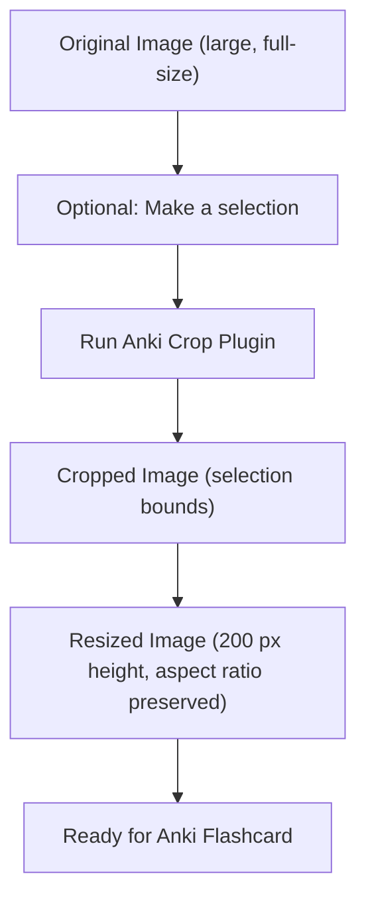

# Anki Cropper Plugin for GIMP 3

**Anki Cropper** is a GIMP 3 plugin designed to simplify preparing images for Anki flashcards. 

Large images can take up significant disk space and may not display properly within a flashcard, sometimes causing parts of your content to appear outside the visible area. This plugin helps solve these problems by automatically cropping and resizing images, ensuring they fit neatly and efficiently in your cards while reducing unnecessary disk usage.

> [!TIP] 
> After installation, you can create a keyboard shortcut in GIMP to run the plugin quickly, making cropping and resizing faster than manually using the selection and scale tools.

## Why This Plugin is Useful

When creating flashcards:

* Large images consume more disk space.
* Oversized images can cause text or other fields to extend beyond the visible flashcard area.
* Cropping and resizing manually in GIMP is time-consuming, especially if you're creating multiple flashcards. 

Anki Cropper automates this process by:

* Cropping to a selection if present.
* Resizing the image to a fixed height (200 px) while keeping the aspect ratio.
* Allowing you to focus on card creation instead of manual image editing.
* Optionally, running the plugin via a custom shortcut for even faster workflow.

## Installation

### 1. Locate GIMP Plugins Folder

To find the correct folder for your system:

1. Open GIMP 3.
2. Go to `Edit`&rarr; `Preferences`&rarr; `Folders` &rarr; `Plug-ins`.
3. Note the folder path listed there. This is where GIMP loads plugins from.

### 2. Copy the Plugin

Place the **`anki-cropper`** folder into the GIMP 3 plugin directory you identified. For example:

* **Windows:**
  `C:\Users\<USER>\AppData\Local\Programs\GIMP 3\lib\gimp\3.0\plug-ins`

* **MacOS:**
  `/Applications/GIMP.app/Contents/Resources/lib/gimp/3.0/plug-ins`

* **Linux:**
  Usually `~/.config/GIMP/3.0/plug-ins` or the system plugin folder `/usr/lib/gimp/3.0/plug-ins`

### 3. Restart GIMP

After copying the plugin, restart GIMP 3 to load the plugin.

## Creating a Shortcut in GIMP

1. Go to `Edit` &rarr; `Keyboard Shortcuts`.
2. Search for **Anki Crop** (under `Filters` &rarr; `Anki`).
3. Assign a preferred key combination (e.g., `Ctrl+Alt+C`).
4. Now you can run the plugin instantly without navigating menus.

## Usage

1. Open an image in GIMP.
2. (Optional) Make a selection for the area you want to crop.
3. Run the plugin via the menu `Filters` &rarr; `Anki` &rarr; `Anki Crop` or your shortcut.
4. The plugin will:

   * Crop the image to your selection (if any).
   * Resize the image to 200 px height while preserving aspect ratio.

Your image is now ready for use in Anki flashcards.

## Example Workflow

This workflow ensures:

* Only relevant parts of the image are kept.
* Images are scaled to a manageable size.
* Flashcards display properly without fields overflowing.

## Requirements

* GIMP 3.x
* Python 3 support in GIMP
* Only tested with GIMP 3; not compatible with GIMP 2.x.

## Notes

* If no selection is made, the plugin resizes the entire image.
* The plugin reduces disk usage and prevents oversized images in Anki flashcards.
* Using a shortcut speeds up repetitive cropping/resizing tasks significantly.

## Author

* Francesco Bez, 2025